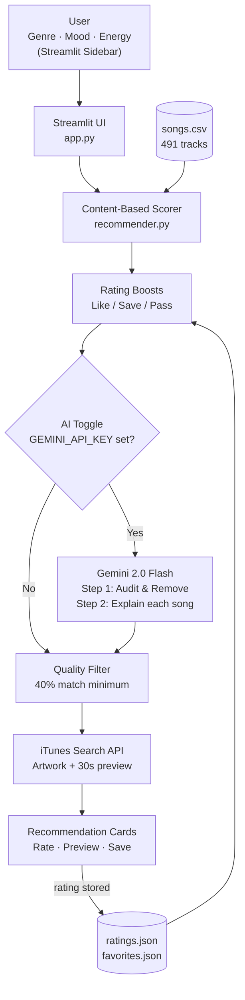

# MusicMind AI Recommender

**CodePath AI110 — Project 4**

---

## What is this?

This started as a small Module 3 coding exercise — a Python script with 18 fake songs and a basic scoring function. I turned it into an actual working music recommender you can use in your browser.

It suggests songs from a catalog of 491 real tracks based on your mood, genre, and energy level. You can rate songs over time and it gets better the more you use it. There's also a vibe search where you type something like "chill music for studying" and it finds matching songs without you needing to pick a genre.

---

## What I built on top of the starter

### 1. AI Explanations (Google Gemini)

When you turn on AI mode, Gemini runs two passes on your recommendations:
- First it checks if any song is a poor fit even though it scored high (like a high-energy trap song slipping into a lofi session) and removes it
- Then it writes a short explanation for each remaining song

No API key? The app still works fine — you just don't get the explanations.

### 2. Rating Memory

You can Like, Save, or Pass songs. Those choices are saved locally and affect future scores:
- Like → +0.75 for that song, small bonus for other songs in the same genre
- Save → +0.40 bonus
- Pass → -0.75 penalty

The more you rate, the more personalized it gets.

### 3. 491 Real Songs

The original 18 placeholder songs (fake artists like "Neon Echo", "Thornwall") were removed. The catalog now has 491 real tracks verified against iTunes, covering 23 genres including pop, hip-hop, r&b, rock, edm, country, jazz, lofi, k-pop, and more.

### 4. Vibe Search (no API key needed)

There's a search box where you describe a mood or moment in plain English. It uses TF-IDF (a local search technique, no external API) to match your description against the song catalog.

How it works: each song's metadata gets expanded with related words. A lofi song's search document includes words like "studying", "coffee", "background", "chill", "coding" even if none of those appear in the raw data. So when you search "background music for studying", it finds the right lofi songs.

Try it: "late night drive", "hype workout songs", "sad emotional breakup"

If you have Gemini set up, it also writes a sentence explaining why each result matched your search.

### 5. iTunes Integration

Every song card shows the album cover and a 30-second audio preview, pulled from the iTunes Search API (free, no key needed).

### 6. Scoring (how songs are ranked)

| What matches | Points |
|---|---|
| Genre | +2.0 |
| Mood | +1.5 |
| Energy (how close) | up to +1.0 |
| Acoustic preference | up to +0.5 |
| **Max** | **5.0** |

Songs below 40% match are hidden — you see fewer but better results.

---

## Setup

### 1. Clone and set up
```bash
git clone <repo-url>
cd ai110-module3show-musicrecommendersimulation-starter
python -m venv .venv
source .venv/bin/activate   # Mac/Linux
pip install -r requirements.txt
```

### 2. Gemini API key (optional)
```bash
cp .env.example .env
# Open .env and add your key: GEMINI_API_KEY=your_key_here
# Free key: https://aistudio.google.com/app/apikey
```
The app works without a key — AI Explanations will just be disabled.

### 3. Run it
```bash
streamlit run app.py
```
Open http://localhost:8501

### 4. CLI demos (optional)
```bash
python demo_pop.py     # pop/happy fan
python demo_lofi.py    # lofi/chill listener
python demo_rock.py    # rock fan
python src/main.py     # all three profiles together
```

### 5. Tests
```bash
pytest                         # 12 unit tests
python tests/test_harness.py   # 8 automated behavior tests with confidence scores
```

---

## How the scoring works

Every song gets scored out of 5.0 against your profile. Genre is the most important signal — if you pick hip-hop, you get hip-hop songs first. Mood is second. Energy is a tie-breaker. Songs below 40% are filtered out entirely.

If you've rated songs before, those ratings shift the scores up or down before the final list is shown.

With AI on, Gemini does a final review to catch anything that looks wrong despite a high score.

---

## Project structure

```
app.py                   — Streamlit web app
src/
  recommender.py         — scoring logic, dataclasses
  ai_explainer.py        — Gemini two-step workflow + vibe search explanations
  rag_retriever.py       — TF-IDF vibe search (no external API needed)
  main.py                — CLI entry point
tests/
  test_recommender.py    — 12 unit tests
  test_harness.py        — 8 behavior tests with confidence scoring
data/
  songs.csv              — 491 songs
  ratings.json           — your saved ratings (auto-created)
  favorites.json         — your saved favorites (auto-created)
demo_pop.py              — CLI demo
demo_lofi.py             — CLI demo
demo_rock.py             — CLI demo
.env.example             — template for API key
model_card.md            — AI model card
```

---

## Architecture



---

## What I tried and what worked

| Experiment | What happened |
|---|---|
| Mood weight higher than genre (+2.0 vs +1.0) | Wrong-genre songs outranked correct-genre ones. Hip-hop fan got rock songs because they shared the "intense" mood. |
| Genre higher than mood (+2.0 vs +1.5) | Genre stays first. Hip-hop fan gets hip-hop. Fixed. |
| Energy weight at +2.0 | Too dominant — songs with matching energy but wrong genre hit 40% match |
| Energy weight at +1.0 | Energy becomes a tie-breaker within genre, not a primary signal |
| No quality floor | Feed padded with 30% matches that shared nothing with the profile |
| 40% quality floor | Fewer results but all relevant |

---

## Known limitations

- Audio features (energy, tempo) are genre-level estimates, not measured from actual audio. Every "pop" song gets energy=0.75 whether it's a slow ballad or a club banger.
- No user accounts — ratings reset on a new machine.
- Catalog skews English-language and Western. Latin, k-pop, and jazz have fewer songs.
- iTunes doesn't have every song (~15% may have no artwork or preview).
- Gemini API has rate limits on the free tier.

---

## Tests

The test harness runs 8 predefined user profiles and checks the recommender's behavior:

| Test | Checks | Result |
|---|---|---|
| pop_fan_top_result_is_pop | Top result for pop/happy user is a pop song | PASS — 1.00 |
| lofi_fan_top_result_is_lofi | Top result for lofi/chill user is a lofi song | PASS — 1.00 |
| scores_sorted_descending | Results sorted highest to lowest | PASS — 1.00 |
| max_score_leq_5 | No song scores above 5.0 | PASS — 1.00 |
| unknown_genre_returns_k_results | Unknown genre still returns results | PASS — 0.33 |
| very_calm_user_gets_low_energy_top3 | Energy=0.05 user gets low-energy songs | PASS — 1.00 |
| acoustic_bonus_increases_score | Acoustic preference raises score | PASS |
| recommend_songs_returns_tuple_structure | Results are (dict, float, str) triples | PASS |

Average confidence: **0.89 / 1.00**
